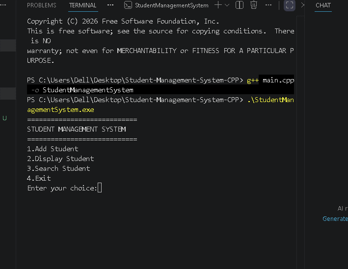
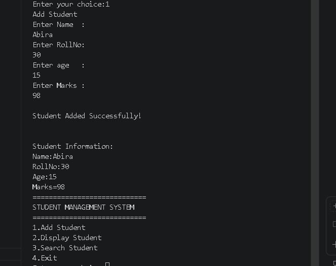
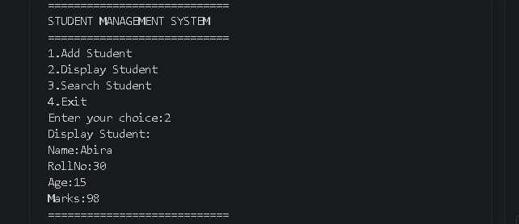
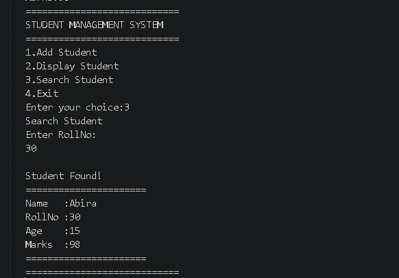
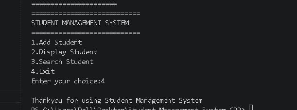

# 🎓 Student Management System (C++)

A console-based Student Management System developed in **C++**. This project demonstrates the implementation of core programming concepts such as conditional statements, loops, variables, user input/output, and basic data management.

## 📌 Features

- ➕ Add Student
- 📋 Display Student Information
- 🔍 Search Student
- 🚪 Exit Program

---

## 🛠️ Technologies Used

- C++
- Visual Studio Code
- Git & GitHub

---

## 🎯 Learning Objectives

This project helped me strengthen my understanding of:

- Variables and Data Types
- Conditional Statements (if-else)
- Loops
- User Input & Output
- Basic Program Structure
- Problem Solving in C++

---

## 👩‍💻 About Me

Hi, I'm **Abira**.

I am a Computer Engineering student with a strong interest in programming and software development.

I have a solid foundation in **C++** and continuously improve my coding skills by building practical projects and learning modern development tools such as Git and GitHub.

---

## 🚀 Future Improvements

- Store student records in files
- Edit and delete student records
- Multiple student support using arrays or structures
- Better menu design
- Object-Oriented Programming (OOP) version

---

## 📬 Contact

GitHub: https://github.com/itsabira16445
---

## 📸 Project Screenshots

### 1. Main Menu

### 2. Add Student

### 3. Display Student

### 4. Search Student

### 5. Exit Program

---

## 📷 Output Preview

This project is successfully compiled and executed using C++. The following screenshots demonstrate the working of the Student Management System.

---

⭐ Thank you for visiting this project. Feedback and suggestions are always welcome!
